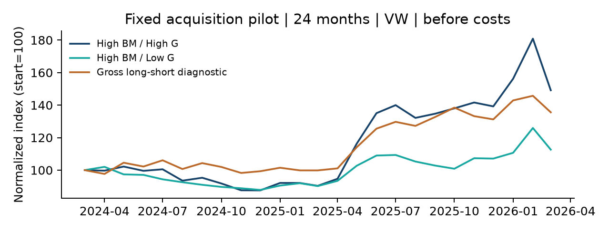

실제 데이터 연구 / 2026-10-09 / EMPIRICAL_LIMITED / 독립 OOS 없음

# Executive Brief | 한국 FF3 x 공시 거버넌스

추가 알파를 지지할 통계적 증거는 확보하지 못했다.

질문: 같은 가치주 안에서 사외이사 비율이 높은 기업의 후행 성과가 다른가? 그 차이가 FF3를 통제한 뒤에도 남는가? 실제 과거 공시·공개일·원본 월수익률로 분석했다. 판정은 EMPIRICAL_LIMITED / 탐색적이다.

| 분석 | 유효 연속월 | 월 스프레드 | FF3 월 알파 / p |
| --- | --- | --- | --- |
| 전수 주 분석 | 3 (최소 24 미달) | -0.72% | NA / NA |
| 150단계 보조 표본 | 24 (2024.04-2026.03) | 1.39% | 0.51% / 0.389 |

전수 주 분석은 4셀 최장 연속 3개월로 회귀 최소 24개월에 미달한다. 별도 고정 150단계 보조 표본은 24개월이며 스프레드 월 1.39%, FF3 알파 월 0.51%, t=0.88, p=0.389, CI [-0.70, 1.73]%다. 보조 H1 평균 p=0.153 역시 비유의다.

G 응답 820개사, 연간 PIT 관측 4,540개, 결합 782개사·38,742 stock-month·59개월이다. 주로 2020-2025사업연도이고 2019년 2개 예외가 있다. API 키는 정상 작동했지만 모든 과거 공시가 요약 API에 존재하지 않았다.

# Executive Brief | 신뢰성 판정과 결론

양의 관측 수익률 차이를 거버넌스 효과로 확정할 수 없다.

사전 고정한 EW, G 30/70, 전체 상위5 제외, legacy FF3, HAC6, 신선도, 분기 재구성 등을 모두 공개했다. 추정된 FF3 민감도 CI는 모두 0을 포함한다. 규모·BM·ROE·레버리지 통제 G 계수도 p=0.400로 비유의다. 수행한 보조 검정 12개를 Holm 보정했고 유의한 결과는 없다.

| 주요 잔존 위험 | 확인한 사실 / 제한 |
| --- | --- |
| 생존·상폐 | 원본 현재목록 부재 285종목; 전체 역사적 모집단·상폐 대가 미확인 |
| 선택·범위 | 현재 원본-KRX 교집합 769종목 모두 유가; 과거 전체시장 대표성 미확인 |
| 규모·규제·업종 | High G 규모·집중도 차이; 과거 업종·법적 별도 자산기준 미확인 |
| 독립 OOS | 주 IS 0 / OOS 3개월, 보조 24개월은 독립 검증으로 인정하지 않음 |
| 실행·비용 | 10/30bp 회전율 관측 23개월로 알파 NA; 공매·조달·유동성 미검증 |

편향 감사 14항목: 절차적 PASS 4, UNVERIFIED 10. 미래 공개일 누수 0건을 확인했고 미래 G/BM 불변, 이사 수 범위, 월 시차, 가중치합, RF 처리, API 실패·비밀정보, 결과 해시를 자동 테스트했다. 원본 120개 파일은 모두 보존했다. 공개 수치 독립 재계산 감사는 PASS다.

결론: 실제 거버넌스 후행 성과를 계산하는 데 성공했으며, 보조 표본에서 추가 알파의 통계적 증거는 없었다. 전수 주 가설은 기간 부족으로 판단 불가다. 효과가 0이라는 증명이나 COE 감소·인과효과·실거래 수익을 주장하지 않는다. 다음 검증은 역사적 모집단·터미널 총수익률·업종·원정정 자료 복구와 튜닝 없는 독립 기간 축적이다.

세부 수치·접수번호·원천 해시·재현법은 연구노트와 공개 CSV, TEST_RESULTS.md에 있다. 본 문서는 미래에셋 연구 프레임을 참고한 개인 연구이며 해당 증권사의 공식 자료가 아니다.
