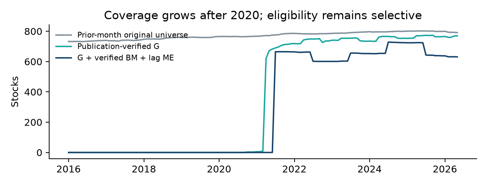
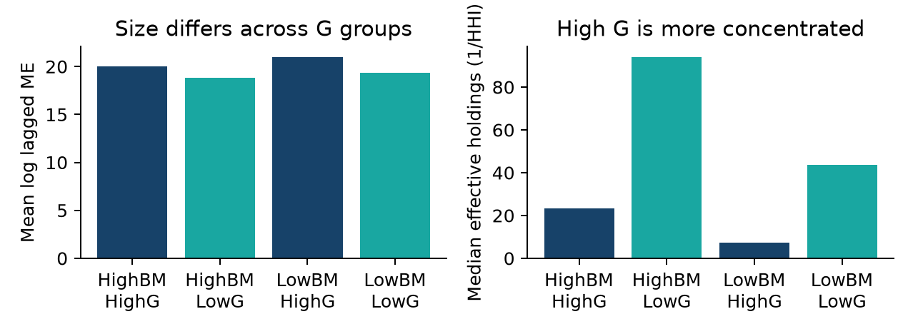
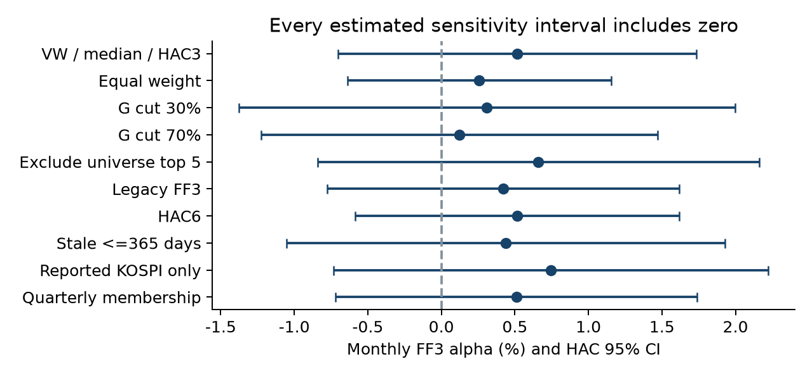

실제 데이터 연구 / 2026-10-09 / EMPIRICAL_LIMITED / 독립 OOS 없음

# 공시 거버넌스는 가치주에 추가 정보를 주는가

실제 공시는 확보했지만, 견고한 추가 알파의 증거는 얻지 못했다.

한국 FF3 연구를 공시 기반 사외이사 비율로 확장했다. 최종 판정은 EMPIRICAL_LIMITED, 탐색적이다. 전수 주 분석은 4셀 모두 유효한 연속 구간이 3개월에 그쳐 사전등록한 24개월 회귀 기준을 충족하지 못했다. 주 가설 H1/H2는 검정 불가(NA)로 남는다.

| 분석 | 유효 연속월 | 월 스프레드 | FF3 월 알파 / p |
| --- | --- | --- | --- |
| 전수 주 분석 | 3 (최소 24 미달) | -0.72% | NA / NA |
| 150단계 보조 표본 | 24 (2024.04-2026.03) | 1.39% | 0.51% / 0.389 |

별도 보조 설계의 24개월 가치군 스프레드는 월 1.39%, FF3 알파는 월 0.51%다. HAC(3) t=0.88, p=0.389, 95% CI [-0.70, 1.73]%로 0을 포함한다. 양의 표본 평균을 반복 가능한 G 프리미엄으로 해석하기 어렵다.

생존·상폐 수익률, 비무작위 커버리지, 과거 업종·규제와 규모의 혼동이 주요 잔존 위험이다. 독립 OOS 검증은 성립하지 않는다. COE 감소나 거버넌스의 인과효과는 추정하지 않았다.

# 1. 가설과 사전등록: 저PBR 안의 G 차이

검정 대상은 동일 가치군의 후행 성과 차이와 FF3 통제 후 잔여 성과다.

H1: HighBM_HighG - HighBM_LowG의 월평균이 0과 다른가? H2: 동일 스프레드의 MKT·SMB·HML 조정 알파가 0과 다른가? 두 검정은 양측이다. G는 사외이사 수 / 전체 이사 수이며 종합 ESG 등급이나 이사회 독립성의 완전한 척도가 아니다.

경제적 가설은 거버넌스 위험 인식이 요구수익률과 적정 PBR에 연결될 수 있다는 것이다. 미래에셋의 2025년 11월 거버넌스 퀀트 방법론, 12월 ESG 레이팅 Preview, 2026년 5월 멀티플 탈출에 관한 사용자 제공 MD를 해석 틀로 참고했다. 해당 보고서의 MSCI 점수·성과·COE 수치를 본 연구 수치로 사용하지 않았다. 개인 연구이며 증권사의 공식 산출물이 아니다.

| 동결 항목 | 적용 규칙 |
| --- | --- |
| 분류 | BM 중위수, 각 BM군 내 G 중위수; 동점은 Low에 유지 |
| BM | 회계연도 t-1 BE / 해당 6월 ME, 실제 재무공시 값·일자 일치 |
| 가중·수익 | 실제 전월 ME VW, 다음 월 가격수익률; 미래 생존 조건 사용 금지 |
| 최소 표본 | 셀별 5종목; 4셀 공통 최장 연속월 최소 24, 동률은 이른 구간 |
| 시점 | 공시 다음 날 이후 첫 KRX 월말 사용, 그 다음 월 수익률 |
| 결측 | 한 보유종목이라도 수익률 미확인 시 전체 셀-월 무효 |
| 추론 | FF3 OLS + HAC(3), G 신선도 550일, HAC6 등 보조 사양 고정 |
| 시간 분리 | IS 2021.12까지, OOS 2022.01 이후; 사후 경계 변경 금지 |

주 사전등록 YAML은 G 전략 성과를 보기 전에 동결했다. 전수 주 분석의 기준을 완화하지 않았다. 보조 150단계 두 가치군 설계는 가용성 감사 뒤, 전략 성과 확인 전에 별도로 기록했다. 가용성에 따른 표본·기간 선택 자체가 선택편향을 일으킬 수 있어 확인적 연구로 승격하지 않는다.

# 2. 실제 공시 확보와 공개 시점 검증

키 인증은 성공했고, 실제 과거 G 자료는 주로 2020년 이후 확보됐다.

공식 G·공시검색·주요 재무계정 API는 status 000 응답을 반환했다. corpCode.xml의 비JSON 응답은 재시도 후 공식 역사적 사업보고서 검색으로 우회했다. 45,570개 접수번호와 종목코드-법인코드의 공식 쌍을 수집해 원본 877종목을 유일하게 매핑했다. 이름 유사도 추정은 사용하지 않았다.

| 사업연도 | 수집 시도 | 연간 G/PIT 통과 | 비고 |
| --- | --- | --- | --- |
| 2015 | 743 | 0 |  |
| 2016 | 752 | 0 |  |
| 2017 | 759 | 0 |  |
| 2018 | 763 | 0 |  |
| 2019 | 769 | 2 | 2019년 예외 2건 |
| 2020 | 782 | 746 |  |
| 2021 | 783 | 761 |  |
| 2022 | 794 | 759 |  |
| 2023 | 802 | 773 |  |
| 2024 | 804 | 780 |  |
| 2025 | 789 | 719 |  |

연간 8,540건 중 4,540건(53.16%)은 실제 접수번호·공개일·원천 해시·이사 수가 확인됐다. 3,858건은 G 응답 부재/모호, 142건은 PIT 미확인으로 제외했다. 분기 테스트 3건을 합친 전체 G 응답은 4,685건이며 주 분석은 연간 공시만 사용한다. 2015-2018년은 이 표본에서 관측되지 않았고 2019년은 2건 예외가 있다. API 키가 있어도 모든 과거 공시가 요약 API에 제공되는 것은 아니다.

실제 공개일 다음 날 이후 이용 가능한 KRX 월말을 확인한 뒤 다음 월 수익률에 연결했다. 동일 금액의 BE가 재무 응답에서 확인되고 해당 접수번호도 공개되었을 때만 BM을 사용했다. 지연된 옛 회계기간 정정이 새 기간 값을 덮지 않도록 기간 우선순위를 적용했다. 관측된 결합 패널에서 미래 공개일 누수는 0건이다. 원정정 전 파일 전체를 복구한 것은 아니다.

# 3. 투자 모집단과 데이터 선택의 한계

1,054종목이라는 규모는 한국 전체 시장의 대표성을 보증하지 않는다.

| 대상/진단 | 실제 확인값 |
| --- | --- |
| 원본 FF3 | 1,054종목, 2000.07-2026.05, 311개월 |
| G / 결합 기업 | G 응답 820개사 / 결합 782개사 |
| 결합 관측 | 38,742 stock-month, 자료 존재 59개월 |
| 현재 KRX 교집합 | 769종목 모두 유가; 현재 코스닥 교집합 0 |
| 현재 목록 부재 | 285종목; 가격 종료가 이른 비현재 종목 279개 |
| 기초 가격 감사 | 비교 224,495건 일치; >100% 제거 659건; 월 간격 불연속 4건 |

현재 KRX 목록은 2026.10.09 스냅샷이다. 과거 코스닥-코스피 이전 기업은 있을 수 있으며 현재 구분을 과거 투자시점 구분으로 대입하지 않았다. 당시 전체 상장·상폐 이력을 대조할 수 없어 생존편향은 UNVERIFIED다. G 커버리지와 재무 매칭도 무작위 결측으로 가정하지 않는다.

원본 보고서는 배당 제외 가격수익률을 사용한다. 독립 NAVER 월봉 5종목과 공식 기업행동 공시를 교차검토했지만 완전한 조정 총수익률·상폐 대가를 확보하지 못했다. 국보의 실제 마지막 가격 급락, 롯데푸드·쌍용C&E의 거래량 0 마지막 봉은 결측을 0%로 대체할 수 없음을 보여준다. DL건설 주식교환의 후속 주식 대가도 원래 티커 수익률과 직접 같지 않다.

# 4. BM x G 2x2: 주 분석과 보조 계산

전수 주 분석의 짧은 구간을 숨기지 않고, 별도 보조 표본과 함께 제시한다.

| 전수 주 분석: 2022.12-2023.02, N=3 | 월평균 % |
| --- | --- |
| High BM / High G | -0.55 |
| High BM / Low G | 0.17 |
| Low BM / High G | -0.86 |
| Low BM / Low G | 0.16 |
| 가치군 G 스프레드 | -0.72 |

전수 4셀 개별 유효월은 23개월이지만 최장 연속 구간은 3개월이다. 동점으로 빈 High G 셀이 생기고, 상폐·정지 종목의 미래 수익률 누락은 셀 전체를 무효화한다. 24개월 기준 미달이므로 주 스프레드 평균 검정과 FF3 알파는 NA다. 3개월 수치에 장기적 추론을 붙이지 않는다.

| 고정 150단계 보조 표본 | N | 월평균 % | 연 변동성 % | 지수 변화 % | MDD % |
| --- | --- | --- | --- | --- | --- |
| High BM / High G | 24 | 2.00 | 28.97 | 49.13 | -17.55 |
| High BM / Low G | 24 | 0.61 | 17.33 | 12.61 | -13.91 |
| Low BM / High G | 23 | 6.03 | 50.45 | NA | NA |
| Low BM / Low G | 22 | -2.66 | 24.77 | NA | NA |
| 가치군 G 스프레드 | 24 | 1.39 | 17.11 | 35.57 | -7.35 |

보조 표본은 초기 smoke를 포함한 고정 150단계 누적 수집군이다. 전체 기간 중 결합된 기업은 138개이며 매월 투자 종목 수와 다르다. 값이 공개된 시점의 정보만 사용한 VW, 원본 가격수익률, 비용 전 결과다.

LowBM 두 셀은 각각 22/23개월만 유효해 평균의 비교 기간이 다르다. 누락월을 이어 붙인 누적성과·MDD는 계산하지 않았다(NA). 가치군 두 셀의 24개월 구간에서는 차이가 계산되지만 전체 4셀의 동일 기간 확인적 비교를 대체하지 않는다.

# 5. FF3 조정 알파와 해석

월 +0.51%의 표본 알파는 추정 오차를 넘는 증거가 아니다.

회귀식: spread = alpha + beta_M(MKT-RF) + beta_S SMB + beta_H HML + error. 양·음 두 포트폴리오 차이이므로 RF를 다시 빼지 않는다. 롱온리 회귀는 해당 월 RF를 한 번 차감한다. 모형과 수익률은 같은 월만 결합한다.

| 보조 FF3 추정 / N=24 | 실제 값 |
| --- | --- |
| 월 알파 / HAC3 t / p | 0.51% / 0.88 / 0.389 |
| 95% CI | [-0.70, 1.73]% |
| OLS t / R2 | 0.54 / 0.402 |
| MKT / SMB / HML beta | 0.428 / 0.164 / 0.229 |
| H1 평균 / t / p | 1.39% / 1.48 / 0.153 |
| 월 평균 95% CI | [-0.56, 3.34]% |

월 스프레드 평균 +1.390%는 모형상 알파 +0.515%와 평균 MKT 노출 기여 +1.147%p, SMB -0.522%p, HML +0.251%p로 분해된다. 이는 회귀 항등식의 표본 내 분해이며 미래 기대수익의 분해가 아니다. 양의 원수익률 차이 상당 부분은 기존 요인과 함께 움직인다.

규모·BM·ROE·레버리지를 함께 통제한 가치군 월별 횡단면 G 계수 평균은 1.10%p, p=0.400다. 평균 59.4종목, 24개월이며 G가 0에서 1로 바뀌는 단위 효과다. 포트폴리오 알파와 다른 추정 대상이고 과거 업종 통제는 불가했다.

요인 상관은 MKT-SMB 약 -0.933, 설계행렬 condition number 44.93이다. 잔차 Breusch-Pagan p=0.020, Ljung-Box(6) p=0.377로 이분산과 작은 표본의 불확실성이 남는다. HAC와 블록 부트스트랩 결과를 함께 제시하되 유리한 추정법을 고르지 않는다.

기초 FF3 legacy는 HML +0.826%, SMB -0.674%/월이고 명세 정렬은 HML +1.144%, SMB -0.822%다(311개월). 장부가치 연결·6월 정렬·연속 ME 시차의 구현 차이가 함께 바뀌므로 차이를 하나의 요인 탓으로 단정하지 않는다. 모든 벤치마크 종목의 재무 PIT와 총수익률 검증은 여전히 조건부다.

# 6. 강건성·과적합: 전체 보조 사양 공개

임계값이나 추정법을 바꿔도 유의한 추가 알파가 나타나지 않았다.

| 보조 사양 | N | 월 알파 % | HAC p |
| --- | --- | --- | --- |
| 기본 VW | 24 | 0.51 | 0.389 |
| EW | 24 | 0.26 | 0.554 |
| G 30% | 24 | 0.31 | 0.706 |
| G 70% | 24 | 0.12 | 0.851 |
| 전체 시총 상위5 제외 | 24 | 0.66 | 0.371 |
| legacy FF3 | 24 | 0.42 | 0.472 |
| HAC6 | 24 | 0.51 | 0.342 |
| G 365일 | 24 | 0.44 | 0.546 |
| 공시 구분 유가 | 24 | 0.75 | 0.305 |
| 분기 재구성 | 24 | 0.51 | 0.396 |

수행 가능한 보조 평균·알파·통제 검정 12개를 하나의 Holm 가족으로 보정했으며 유의한 결과는 없다. 수행 불가 사양도 표에 남겼다. 주 가설 H1/H2는 NA로 별도 구분한다. 각 사양을 독립 실험처럼 간주하지 않는다.

코스닥 구분 보조는 유효월 0, 연간 재구성은 21개월로 미추정이다. 10/30bp 비용 보조는 첫 유효월 회전율이 미확인이라 N=23, 알파 NA다. 비용 후 평균은 동일한 23개월 비용 전 평균과 비교하며, 기본 24개월 평균과 비교해 비용 차감 후 더 좋아졌다고 해석하지 않는다.

# 7. 표본 불확실성과 독립 검증

38,742개 종목-월은 알파 회귀의 독립 관측 38,742개가 아니다.

추론의 단위는 공통 월 수익률이다. 전수 주 구간은 3개월, 보조는 24개월에 불과하다. 고정 IS/OOS 경계의 주 분석 유효 IS는 0개월, OOS는 3개월이다. 보조 구간이 시간상 2022년 이후에 위치해도 충분한 독립 설계·학습 표본이 없어 OOS validated라고 표시할 수 없다.

| 순환 시간블록 길이 | 반복 | 알파 95% CI (%/월) | 평균 95% CI (%/월) |
| --- | --- | --- | --- |
| 6 | 2000 | [-0.87, 1.54] | [-0.31, 3.42] |
| 12 | 2000 | [-0.46, 1.03] | [-0.07, 2.88] |

seed 1993, 월 스프레드와 FF3를 짝지어 6/12개월 시간블록으로 재표본했다. 종목을 다시 선정하는 부트스트랩이 아니며 고정된 역사적 포트폴리오 경로의 시간 의존 불확실성만 반영한다. 두 알파 구간 모두 0을 포함한다. 단 24개월에서 긴 블록의 유효 정보가 적다는 한계가 있다.

월 하나씩 제외한 진단 알파 범위는 0.01%에서 0.81%다. 제외하면 N=23으로 떨어지므로 이를 새 유의성 검정으로 쓰지 않았다. 특정 월을 제거하거나 윈저라이징해 주 결과를 다시 선택하지 않았다.

형성은 전월 모집단으로 구성하고 미래 수익률을 LEFT JOIN한다. 과거 값에 미래 G·BM을 주입해도 과거 형성 결과가 불변인지 테스트했다. 공시 말일·휴일, 구기간 지연 정정, 금융 단위 100배 오류, 이사 수 범위와 가중치합을 검증했다. 실제 API 자료는 합성 테스트 자료와 분리했다.

사후 수정 이력: 중간 셀 가용성 집계는 50/15개월이었다. 미래 수익률 누락을 모집단에서 제거하지 않도록 고친 뒤 최종 주 가용성이 23/3개월로 줄었다. 동결된 주 기준은 유지했다. 동일 NI 중복 4,340건은 값이 같음이 확인되어 ROE를 복구했고, 핵심 선정·가중·수익률 해시는 전후 동일했다. 누락 LowBM 경로의 누적/MDD도 NA로 정정했다.

# 8. 편향 감사와 주장 허용 수준

진단을 수행한 항목과 편향이 해결된 항목은 구분해야 한다.

| 검증 항목 | 판정 | 중요도 |
| --- | --- | --- |
| 공개일 / 미래정보 | PASS | high |
| 생존 / 상폐 | UNVERIFIED | high |
| 커버리지 선택 | UNVERIFIED | high |
| 규모·업종·수익성 | UNVERIFIED | high |
| 법정 최소비율 혼동 | UNVERIFIED | high |
| 대형주 집중 | PASS | medium |
| 신선도·정정 | UNVERIFIED | high |
| 임계값 선택 | PASS | medium |
| 시간·OOS | UNVERIFIED | high |
| 다중검정 | PASS | medium |
| 이상치·영향력 | UNVERIFIED | high |
| 비용·실행 가능성 | UNVERIFIED | high |
| 요인 정의 | UNVERIFIED | high |
| 모형 불확실성 | UNVERIFIED | medium |

PASS 4개는 공개일 확인·집중도 진단 수행·임계값 동결·다중검정 기록의 절차적 통과를 뜻한다. 집중도가 낮다거나 모든 편향이 제거됐다는 뜻은 아니다. UNVERIFIED 10개에는 역사적 전체 상장집합, 터미널 수익률, 과거 업종, 원정정 전 수치, 독립 OOS, 거래 가능성 등이 포함된다. 주 Gate D는 최소 연속월 기준 미달이다.

2025년 자산 2조원 이상 집단 G 평균은 약 0.560, 그 미만/미확인 집단은 0.409다. 사외이사 비율은 규모별 법정 요건과 기계적으로 연결될 수 있다. 연결 총자산이 법령상의 별도 법인 자산 기준과 같다고 확인하지 못했으며, 당시 개별 회사 예외도 완전 검증하지 않았다.

따라서 허용되는 결론은 '공시 G로 가치군을 나누어 실제 후행 수익률과 조건부 FF3 알파를 계산했지만, 보조 표본에서 유의한 추가 정보의 증거가 없고 전수 주 검정은 기간 부족으로 판단 불가'다. 효과가 반드시 0이라는 증명, 한국 전체 시장 프리미엄, COE 감소, 정책 인과효과, 새로운 ESG 팩터, 실거래 성과는 주장할 수 없다.

# 9. 증빙·재현과 후속 연구

공개 결과표로 수치를 감사하고, 원자료로 신호 시점을 재현할 수 있다.

| 대표 공시 | 사업연도 | 사외/전체 | 실제 공개일 | 접수번호 |
| --- | --- | --- | --- | --- |
| 화천기공 | 2024 | 2/7 | 2025-03-12 | 20250312000803 |
| 삼성전자 | 2024 | 6/9 | 2025-03-11 | 20250311001085 |
| 현대엘리베이터 | 2024 | 4/7 | 2025-03-18 | 20250318000920 |
| 카카오 | 2024 | 5/8 | 2025-03-24 | 20250324000901 |
| 셀트리온 | 2024 | 8/12 | 2025-03-17 | 20250317000929 |

접수번호는 data/smoke_evidence.csv의 공식 DART 링크로 연결된다. data/raw_manifest.csv와 source_audit.csv에는 원천 응답 SHA256, 조회 인자, 공개일 확인·제외 이유를 남겼다. 인증키와 원본 API 응답, 신규 stock-level FnGuide 파생 패널은 게시하지 않는다. 공개 집계 CSV로 수익률 차이·회귀·HAC CI·성과 경로를 독립 재계산하는 src.public_audit가 PASS했다.

실제 실행: python -m src.execute_acquisition; python -m src.financial_controls; python -m src.run_ff3_alpha; python -m src.supplementary_analysis; python -m src.supplementary_robustness; python -m src.bias_overfit_audit; python -m src.cli verify-public; python -m pytest -q tests. 최신 명령·통과 수는 TEST_RESULTS.md에 기록한다.

원본 120개 파일의 SHA256은 전후 모두 동일하다. 기준 커밋 81f3bd921ffcb4ea84c19123d798fbcb830ee9e3, 성과 확인 전 코드 동결 4b754c3faaa28ef24a20b03caab64ede9b1cca76. 로컬 사전등록·수정 이력은 references/research_history.bundle로 보존하고 최종 게시 커밋은 GitHub PR에서 확인한다. bundle에는 기존 대용량 원자료를 중복 포함하지 않는다.

다음 실증의 우선순위는 과거 상장·상폐 대가와 조정 총수익률의 복구, 2020년 이전 원공시의 이사 수 추출, 역사적 업종·규제 기준 확보다. 이후 튜닝 없이 새 기간을 축적해 독립 holdout을 검증한다. 현재 한계를 유의한 사양 탐색으로 우회하지 않는다.

출처: 원본 한국 FF3 보고서·6개 포트폴리오 스크립트·FnGuide 파생 패널; OpenDART G/공시검색/주요계정 공식 가이드; KRX KIND 현재 목록 및 기업행동 공시; NAVER 독립 월봉(5종목 부분 감사); exchange_calendars XKRX; 사용자 제공 MiraeAsset 연구 MD. 세부 URL과 본 연구에서의 역할은 references/REFERENCE_MAP.md와 data/data_dictionary.md에 있다.
